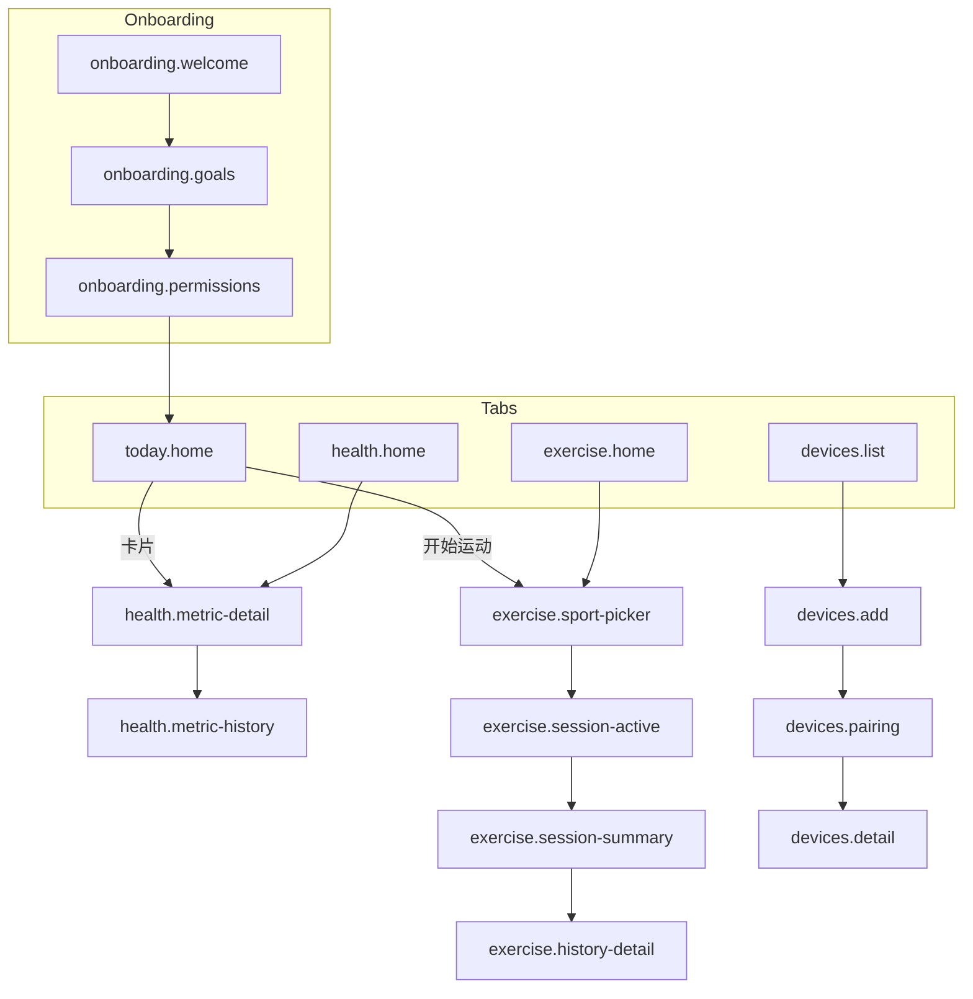

# 屏幕清单 Screen Inventory

> 供 FigJam 流程、Lo-fi / Mid-fi 标注与开发对齐使用。  
> 命名规则：`{tab或区域}.{屏幕名}`，全小写，连字符分词。

**平台：** iOS 手机 · 390×844  
**导航：** 底部固定 4 Tab — Today · Health · Exercise · Devices

---

## 总览统计

| 区域 | 屏幕数 | Must 屏幕数 |
|------|--------|-------------|
| Onboarding | 5 | 4 |
| Today | 3 | 2 |
| Health | 4 | 3 |
| Exercise | 7 | 5 |
| Devices | 5 | 4 |
| Insights | 2 | 0 |
| Settings / Profile | 4 | 1 |
| Membership | 2 | 0 |
| Global / System | 4 | 3 |
| **合计** | **36** | **22** |

---

## 完整屏幕表

| 屏幕 ID | 中文名称 | 区域 | 优先级 | 入口 | 出口/跳转 |
|---------|----------|------|--------|------|-----------|
| `onboarding.welcome` | 欢迎页 | Onboarding | Must | 冷启动 | `onboarding.goals` / `onboarding.permissions` |
| `onboarding.login` | 登录注册 | Onboarding | Should | 欢迎页 | `onboarding.goals` / `today.home` |
| `onboarding.goals` | 目标偏好 | Onboarding | Must | 欢迎/登录 | `onboarding.permissions` |
| `onboarding.permissions` | 权限引导 | Onboarding | Must | 目标页 | `onboarding.device-prompt` / `today.home` |
| `onboarding.device-prompt` | 设备连接引导 | Onboarding | Should | 权限页 | `devices.add` / `today.home` |
| `today.home` | 今日首页 | Today | Must | 默认 Tab / 冷启动完成 | `health.metric-detail`, `exercise.sport-picker`, `insights.weekly` |
| `today.card-detail` | 今日卡片展开 | Today | Should | 今日首页卡片 | `health.metric-detail` |
| `today.evening-recap` | 晚间回顾 | Today | Should | 今日首页 / 推送 | `today.home`, `insights.weekly` |
| `health.home` | 健康概览 | Health | Must | Health Tab | `health.metric-detail`, `health.category` |
| `health.category` | 健康分类列表 | Health | Must | 健康概览 | `health.metric-detail` |
| `health.metric-detail` | 指标详情 | Health | Must | 健康概览/今日/分类 | `health.metric-history`, `insights.weekly` |
| `health.metric-history` | 指标历史 | Health | Must | 指标详情 | `health.metric-detail` |
| `exercise.home` | 运动首页 | Exercise | Must | Exercise Tab | `exercise.sport-picker`, `exercise.history` |
| `exercise.sport-picker` | 运动类型选择 | Exercise | Must | 运动首页/今日快捷 | `exercise.session-prep` |
| `exercise.session-prep` | 开练前准备 | Exercise | Should | 运动类型选择 | `exercise.session-active` |
| `exercise.session-active` | 运动中 | Exercise | Must | 开练准备/快捷开始 | `exercise.session-summary` |
| `exercise.session-summary` | 运动总结 | Exercise | Must | 运动结束 | `exercise.home`, `exercise.history-detail` |
| `exercise.history` | 运动历史列表 | Exercise | Must | 运动首页 | `exercise.history-detail` |
| `exercise.history-detail` | 单次运动详情 | Exercise | Must | 历史列表/总结页 | `exercise.session-summary` |
| `devices.list` | 设备列表 | Devices | Must | Devices Tab | `devices.add`, `devices.detail` |
| `devices.add` | 添加设备 | Devices | Must | 设备列表/Onboarding | `devices.pairing` |
| `devices.pairing` | 配对进行中 | Devices | Must | 添加设备 | `devices.pair-success`, `devices.add` |
| `devices.pair-success` | 配对成功 | Devices | Should | 配对完成 | `devices.detail`, `devices.list` |
| `devices.detail` | 设备详情 | Devices | Must | 设备列表 | `devices.list`, `devices.add` |
| `insights.weekly` | 周洞察 | Insights | Should | Today / Health | `insights.monthly`, `health.metric-detail` |
| `insights.monthly` | 月洞察 | Insights | Later | 周洞察 | `health.metric-detail` |
| `settings.home` | 设置首页 | Settings | Must | 各 Tab 头像/设置 | 子设置页 |
| `settings.notifications` | 通知设置 | Settings | Should | 设置首页 | `settings.home` |
| `settings.units` | 单位与格式 | Settings | Should | 设置首页 | `settings.home` |
| `settings.privacy` | 隐私与数据 | Settings | Should | 设置首页 | `settings.home` |
| `profile.home` | 个人资料 | Profile | Should | 设置首页 | `settings.home` |
| `membership.overview` | 会员权益 | Membership | Later | 设置/洞察 | `membership.subscribe` |
| `membership.subscribe` | 订阅购买 | Membership | Later | 会员权益 | `membership.overview` |
| `global.loading` | 全局加载 | System | Must | 任意异步 | 返回来源 |
| `global.error` | 全局错误 | System | Must | 请求失败 | 重试 / 返回 |
| `global.empty` | 通用空状态 | System | Must | 无数据场景 | 引导 CTA |
| `global.search` | 搜索（指标/运动） | System | Later | Health / Exercise | 详情页 |

---

## 按 Tab 分组

### Today
| 屏幕 ID | 优先级 |
|---------|--------|
| `today.home` | Must |
| `today.card-detail` | Should |
| `today.evening-recap` | Should |

### Health
| 屏幕 ID | 优先级 |
|---------|--------|
| `health.home` | Must |
| `health.category` | Must |
| `health.metric-detail` | Must |
| `health.metric-history` | Must |

### Exercise
| 屏幕 ID | 优先级 |
|---------|--------|
| `exercise.home` | Must |
| `exercise.sport-picker` | Must |
| `exercise.session-prep` | Should |
| `exercise.session-active` | Must |
| `exercise.session-summary` | Must |
| `exercise.history` | Must |
| `exercise.history-detail` | Must |

### Devices
| 屏幕 ID | 优先级 |
|---------|--------|
| `devices.list` | Must |
| `devices.add` | Must |
| `devices.pairing` | Must |
| `devices.pair-success` | Should |
| `devices.detail` | Must |

---

## Must 屏幕清单（Lo-fi 最低覆盖）

```
onboarding.welcome
onboarding.goals
onboarding.permissions
today.home
health.home
health.category
health.metric-detail
health.metric-history
exercise.home
exercise.sport-picker
exercise.session-active
exercise.session-summary
exercise.history
exercise.history-detail
devices.list
devices.add
devices.pairing
devices.detail
settings.home
global.loading
global.error
global.empty
```

---

## 主导航流（FigJam 建议连线）



---

*与 [`PRD.md`](./PRD.md) 同步维护 · v0.1*
