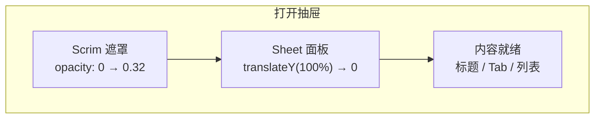
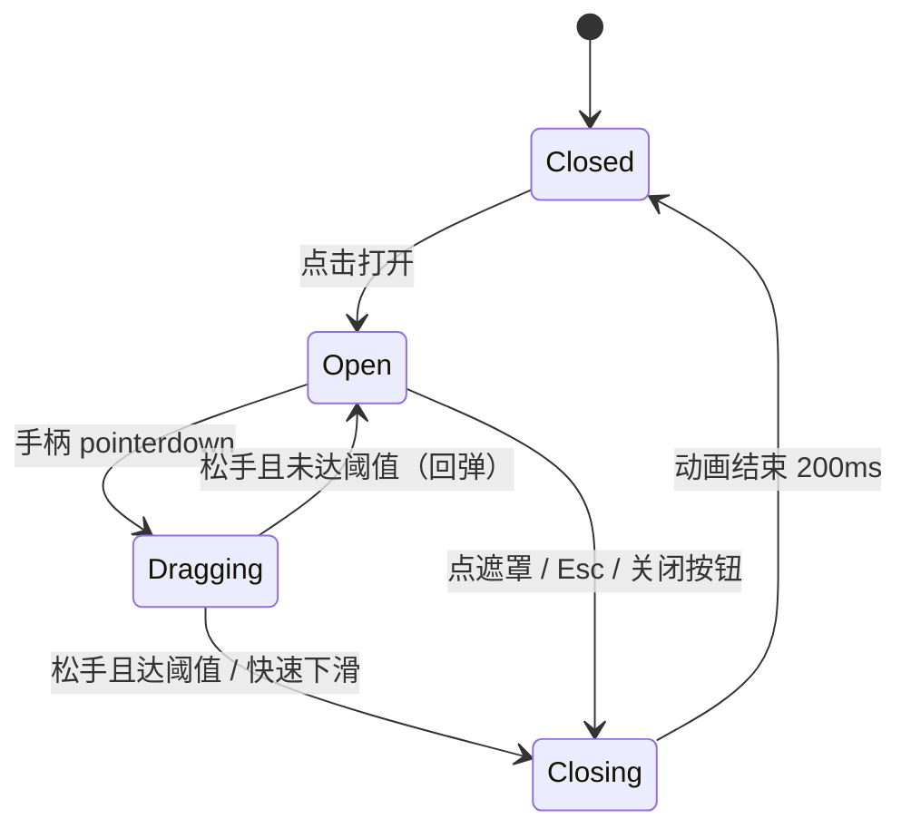

# Material 3 半屏 Bottom Sheet — 设计文档

> 本文档总结本 demo 的 **设计关键点**、**推荐代码结构** 与 **详细中文解读**。  
> 在线体验：https://446500261psf.github.io/portfolio/demo.html

---

## 1. 设计目标

### 要解决什么问题？

用户在移动端需要一个 **从底部弹出的半屏面板**，用来承载次要任务（选择、阅读、确认），同时：

- 不离开当前页面上下文
- 手势自然、可预期
- 视觉上符合 Material Design 3（M3）
- 代码结构清晰，方便迁移到 Android Compose / iOS / 其他框架

### 本 demo 的具体目标

1. 实现 **半屏高度** 的模态 Bottom Sheet
2. 支持 **遮罩点击、拖拽手柄、Esc 键** 关闭
3. 抽屉内展示 **带逐行中文备注的源码**，帮助理解「设计 → 代码」的映射
4. 在 GitHub Pages 上可直接用手机访问验证手感

---

## 2. 设计关键点总览

| 维度 | 关键决策 | M3 规范 / 数值 |
|------|----------|----------------|
| **层级** | Scrim 遮罩 + Sheet 面板，两层分离 | Scrim 黑色 32% 透明度 |
| **尺寸** | 半屏，内容区可滚动 | `max-height: 50vh` |
| **形状** | 仅顶部圆角 | 28px（Extra Large Top） |
| **手柄** | 顶部 Drag Handle，拖拽只绑在手柄上 | 32×4px 横条 |
| **进入动效** | 面板从屏外滑入 + 遮罩淡入 | 300ms，emphasized decelerate |
| **关闭动效** | 面板滑出 + 遮罩淡出 | 200ms，emphasized accelerate |
| **跟手拖拽** | 拖拽时去掉 CSS transition | `transform` + CSS 变量 |
| **关闭判定** | 位移阈值 + 甩动速度 | 120px / 0.8 px/ms |
| **无障碍** | `role="dialog"`、`aria-modal`、Esc 关闭 | 遮罩可聚焦 |
| **安全区** | 底部按钮避开 Home Indicator | `env(safe-area-inset-bottom)` |
| **响应式** | 宽屏居中，最大 480px | `@media (min-width: 600px)` |

---

## 3. 交互设计解读

### 3.1 三层动画同时发生

打开抽屉时，不是「只有一个元素在动」，而是三层协同：



**中文解读：**

- **遮罩（Scrim）** 负责告诉用户「后面的页面暂时不可操作了」，像舞台灯光暗下来，聚光灯打在新面板。
- **面板（Sheet）** 负责承载内容和手势，必须从屏幕底缘「长出来」，而不是凭空淡入——这样用户能理解空间关系。
- **内容** 在动画开始时就应已布局好，避免动画结束后内容突然跳动（layout shift）。

### 3.2 关闭路径必须多样

| 方式 | 用户预期 | 实现要点 |
|------|----------|----------|
| 点遮罩 | 「我不想看了」 | 整屏可点区域，除面板外 |
| 拖手柄向下 | 「像原生 App 一样关掉」 | 跟手 + 吸附判定 |
| 按 Esc | 键盘用户习惯 | `useEffect` 监听 |
| 点「关闭」按钮 | 明确出口 | 文字按钮，低干扰 |

**中文解读：**  
移动端用户最信任的是 **拖拽关闭**。如果只给按钮关闭，会感觉「像网页弹窗」；加上拖拽后，手感接近系统原生 Sheet。

### 3.3 拖拽的状态机

抽屉拖拽不是连续乱动，而是一个简单状态机：



**中文解读：**

- `dragging = true` 时必须 **关掉 CSS transition**，否则面板会「追着手指跑」，有延迟感。
- 松手时要同时看 **位移** 和 **速度**：拖得不远但甩得快，也应关闭——这符合用户直觉。
- `closing` 是独立状态，因为关闭动画比打开 **更短、更干脆**（200ms vs 300ms），符合 M3「进入柔和、退出利落」的原则。

---

## 4. 视觉设计解读

### 4.1 颜色（Color Roles）

本 demo 使用 M3 浅色主题的 **语义色角色**，而不是写死「这是紫色按钮」：

| Token | 值 | 控制什么 |
|-------|-----|----------|
| `--md-sys-color-primary` | `#6750a4` | 主按钮、行号强调色 |
| `--md-sys-color-surface` | `#fef7ff` | 页面背景 |
| `--md-sys-color-surface-container-low` | `#f7f2fa` | 抽屉面板背景 |
| `--md-sys-color-surface-container-high` | `#ece6f0` | 代码行卡片背景 |
| `--md-sys-color-scrim` | `#000000` | 遮罩基色（再叠 32% 透明度） |
| `--md-sys-color-on-surface-variant` | `#49454f` | 副标题、备注文字 |

**中文解读：**  
M3 不推荐直接用 `color: #6750a4` 散落在各处，而是先定义 **角色（role）**，再让组件引用角色。换主题（深色模式、品牌色）时只改变量，不改组件代码。

### 4.2 形状（Shape）

- 抽屉 **只有顶部两角** 有 28px 圆角
- 底部贴屏幕边缘，圆角为 0

**中文解读：**  
这是 M3 对 Bottom Sheet 的明确暗示——它从屏幕底部「长」出来，底部与设备边缘融为一体；顶部圆角则表达「这是一张浮起的卡片」。

### 4.3 动效（Motion）

| 场景 | 时长 | 曲线 | 含义 |
|------|------|------|------|
| 打开 | 300ms | emphasized decelerate | 快速启动，缓慢停住 |
| 关闭 | 200ms | emphasized accelerate | 快速收回，不拖泥带水 |
| 按钮 hover | 200ms | emphasized decelerate | 轻微反馈 |

**中文解读：**  
`cubic-bezier` 不是装饰。decelerate 让进入感觉「有重量、有缓冲」；accelerate 让退出感觉「干脆收走」。这比线性 `ease` 更接近真实物理。

### 4.4 阴影（Elevation）

面板使用两层 `box-shadow`，模拟 M3 Level 3 左右的抬升感。

**中文解读：**  
阴影告诉用户：面板在 Z 轴上高于页面内容。没有阴影时，面板会像「贴在背景上的一块色块」，层次感不足。

---

## 5. 推荐代码结构

### 5.1 目录结构（当前 demo）

```
src/demo/
├── main.tsx                      # demo 入口，挂载 React
├── Material3BottomSheetDemo.tsx  # 页面 + 抽屉 + 手势逻辑
├── material3-bottom-sheet.css    # M3 token + 全部样式
├── annotatedCode.ts              # 逐行源码备注数据（与 UI 解耦）
└── design.md                     # 本设计文档
```

**为什么这样拆？**

| 文件 | 职责 | 不应做什么 |
|------|------|------------|
| `main.tsx` | 启动 demo | 不写业务逻辑 |
| `Material3BottomSheetDemo.tsx` | 状态、手势、DOM 结构 | 不硬编码大段备注文本 |
| `material3-bottom-sheet.css` | 视觉、动效、布局 | 不写 JS 行为 |
| `annotatedCode.ts` | 教学内容数据 | 不渲染 UI |

### 5.2 组件结构（推荐拆分）

当前为教学 demo，逻辑集中在一个文件。生产环境建议拆成：

```
BottomSheetDemoPage
├── DemoHeader                    # 静态说明区
├── DemoTriggerButton             # 打开按钮
└── BottomSheet                   # 可复用抽屉壳子
    ├── BottomSheetScrim          # 遮罩
    └── BottomSheetPanel          # 面板
        ├── BottomSheetHandle     # 拖动手柄（手势只绑这里）
        ├── BottomSheetHeader     # 标题区
        ├── CodeFileTabs          # TSX / CSS 切换
        ├── BottomSheetBody       # 可滚动内容
        │   └── CodeAnnotator     # 逐行备注渲染
        └── BottomSheetActions    # 底部操作
```

**中文解读：**

- **`BottomSheet`** 应成为可复用组件，通过 `children` 注入内容，而不是把「播放列表」「源码」写死在壳子里。
- **手势只绑在 `BottomSheetHandle`**，避免和内容区滚动冲突——这是本 demo 的一个重要细节。
- **`CodeAnnotator`** 是纯展示组件，只接收 `AnnotatedFile`，方便以后换成别的教学内容。

### 5.3 状态结构（React）

```typescript
// 抽屉生命周期
open: boolean        // 是否显示（控制 is-open、aria-hidden）
closing: boolean     // 是否正在播放关闭动画

// 拖拽
dragOffset: number   // 面板下移像素，映射到 --sheet-drag-offset
dragging: boolean    // 是否跟手拖拽中（映射到 is-dragging）

// 内容
activeFileId: 'tsx' | 'css'  // 当前查看的源码文件

// 拖拽中间值（不触发 render）
dragRef: { startY, offset, dragging }
lastMoveRef: { y, t }         // 用于计算甩动速度
```

**中文解读：**

- `open` 和 `closing` 必须分开：如果只有 `open`，关闭动画播不完就会被卸载。
- `dragOffset` 走 state（要触发 UI 更新）；`startY` 走 ref（中间过程不需要 render）。
- 这是 React 动画常见模式：**render 状态 + ref 缓存高频采样**。

### 5.4 CSS 类名结构（BEM 风格）

```
.m3-sheet-root              # 全屏 overlay 容器
  .is-open                  # 打开：可点击、触发动画
  .m3-sheet-scrim           # 遮罩
    .is-dragging            # 拖拽时去掉 opacity 过渡
  .m3-sheet-panel           # 面板
    .is-dragging            # 拖拽时去掉 transform 过渡
    .is-closing             # 关闭动画：滑回 100%
    .m3-sheet-handle        # 手柄区
    .m3-sheet-header        # 标题
    .m3-sheet-body          # 可滚动内容
    .m3-sheet-actions      # 底部按钮
```

**中文解读：**  
用 `is-open` / `is-dragging` / `is-closing` 表达 **行为状态**，而不是用 JS 直接改 `style.transform` 做所有事。  
只有 `dragOffset` 用 CSS 变量传入——因为它是连续值，class 无法枚举。

### 5.5 数据结构（逐行备注）

```typescript
type AnnotatedLine = {
  line: number    // 对应源文件行号
  code: string    // 该行源码原文
  note: string    // 中文解读：这行控制什么
}

type AnnotatedFile = {
  id: 'tsx' | 'css'
  filename: string
  language: string
  lines: AnnotatedLine[]
}
```

**中文解读：**  
备注数据和 UI 分离，以后可以：

- 从脚本自动生成 `annotatedCode.ts`
- 增加第三个文件（如 `annotatedCode.json` 的配置）
- 做 i18n，把 `note` 换成英文

而不必改 `CodeAnnotator` 组件。

---

## 6. 核心实现映射（设计 → 代码）

### 6.1 半屏高度

**设计意图：** 用户仍能看到上方 50% 的页面，知道「自己还在原来的上下文里」。

**代码结构：**

```css
.m3-sheet-panel {
  max-height: 50vh;   /* 关键：视口高度的一半 */
  display: flex;
  flex-direction: column;
}
.m3-sheet-body {
  flex: 1;
  overflow-y: auto;   /* 超出部分在抽屉内滚动，不是整页滚 */
}
```

**详细解读：**  
`50vh` 是相对视口的高度，比固定 `400px` 更适合不同手机。`flex: 1` + `overflow-y: auto` 保证：标题和按钮高度固定，中间内容区吃掉剩余空间并在内部滚动。

---

### 6.2 从底部滑入

**设计意图：** 面板像从设备底部推上来，而不是从中间弹出。

**代码结构：**

```css
/* 默认：藏在屏幕下方 */
.m3-sheet-panel {
  transform: translateY(100%);
  transition: transform 300ms cubic-bezier(0.05, 0.7, 0.1, 1);
}
/* 打开：滑到正常位置 */
.m3-sheet-root.is-open .m3-sheet-panel {
  transform: translateY(var(--sheet-drag-offset, 0px));
}
```

```tsx
// JS 只负责开关和拖拽偏移
style={{ '--sheet-drag-offset': `${dragOffset}px` }}
```

**详细解读：**  
动画动的是 `transform`，不是 `top` / `height`，因为 transform 走 GPU 合成，更顺滑。`translateY(100%)` 的百分比相对 **自身高度**，所以同一套代码在半屏和全屏都能工作。

---

### 6.3 跟手拖拽

**设计意图：** 手指拖多少，面板动多少，零延迟。

**代码结构：**

```tsx
// 1. 只在手柄上监听
<div className="m3-sheet-handle"
  onPointerDown={onPointerDown}
  onPointerMove={onPointerMove}
  onPointerUp={onPointerUp}
>

// 2. 拖拽中关掉 transition
className={`m3-sheet-panel${dragging ? ' is-dragging' : ''}`}

// 3. 只允许向下
const nextOffset = Math.max(0, dragRef.current.offset + delta)
setDragOffset(nextOffset)
```

```css
.m3-sheet-panel.is-dragging {
  transition: none;
}
```

**详细解读：**  
`pointer events` 统一鼠标和触摸。`setPointerCapture` 保证手指移出手柄区域仍能跟手。`Math.max(0, …)` 防止面板被拖到屏幕上方——那会破坏 Bottom Sheet 的空间隐喻。

---

### 6.4 关闭判定（位移 + 速度）

**设计意图：** 轻轻拖一点会回弹；拖过一半或「甩」下去就关闭。

**代码结构：**

```typescript
const DISMISS_THRESHOLD = 120  // 像素
const DISMISS_VELOCITY = 0.8     // px/ms

const velocity = (event.clientY - lastMoveRef.current.y) / dt
const shouldDismiss =
  dragOffset > DISMISS_THRESHOLD || velocity > DISMISS_VELOCITY
```

**详细解读：**  
只用位移会让「快速轻甩」关不掉；只用速度会让「慢慢拖很远」关不掉。两个条件取 OR，覆盖更多真实手势。阈值 120px 约为半屏 demo 高度的 1/4～1/3，手感上「拖一点会弹回，拖够多会关」。

---

### 6.5 遮罩 32%

**设计意图：** 背景变暗但不死黑，仍能感知下方页面。

**代码结构：**

```css
.m3-sheet-scrim {
  background: #000;
  opacity: 0;
  transition: opacity 300ms ...;
}
.m3-sheet-root.is-open .m3-sheet-scrim {
  opacity: 0.32;
}
```

**详细解读：**  
M3 规定 Scrim 为 32% 黑。超过 40% 会有「全屏黑幕」压迫感；低于 20% 则遮罩存在感不足，用户不知道后面不可点。

---

### 6.6 背景滚动锁定

**设计意图：** 抽屉打开时，后面的页面不能跟着滚。

**代码结构：**

```tsx
useEffect(() => {
  if (!open) return
  const previousOverflow = document.body.style.overflow
  document.body.style.overflow = 'hidden'
  return () => {
    document.body.style.overflow = previousOverflow
  }
}, [open])
```

**详细解读：**  
这是 Web 端常见补丁。原生 Android `ModalBottomSheet` 由系统处理；Web 必须手动锁 `body`。注意在 cleanup 里 **恢复原值**，避免关闭抽屉后页面永久无法滚动。

---

## 7. 无障碍（Accessibility）

| 要求 | 实现 |
|------|------|
| 读屏器识别为对话框 | `role="dialog"` + `aria-modal="true"` |
| 朗读标题 | `aria-labelledby="sheet-title"` |
| 关闭方式 | 遮罩 `aria-label="关闭抽屉"` + Esc |
| 装饰性手柄 | `aria-hidden` on handle |
| 文件 Tab | `role="tablist"` + `aria-selected` |

**中文解读：**  
拖拽手柄是装饰性的，不应抢读屏焦点；真正重要的是标题和关闭路径。生产环境还应加 **焦点陷阱（focus trap）**：打开时焦点移入抽屉，关闭时焦点回到触发按钮。

---

## 8. 响应式策略

| 断点 | 行为 |
|------|------|
| `< 600px`（手机） | 面板全宽，贴底 |
| `≥ 600px`（平板/桌面） | 宽 480px，水平居中 |

**代码结构：**

```css
@media (min-width: 600px) {
  .m3-sheet-panel {
    left: 50%;
    width: min(100%, 480px);
    transform: translate(-50%, 100%);
  }
  .m3-sheet-root.is-open .m3-sheet-panel {
    transform: translate(-50%, var(--sheet-drag-offset, 0px));
  }
}
```

**中文解读：**  
大屏上全宽抽屉会像「横条」，不美观也不符合 M3 桌面/平板表现。居中窄面板更像「浮动卡片」。注意打开态和关闭态的 `transform` 都要带 `translate(-50%, …)`，否则水平居中会失效。

---

## 9. 与 Android Compose 的对应关系

本 demo 是 Web 实现，但设计意图与 M3 `ModalBottomSheet` 一致：

| 设计点 | Web demo | Android Compose |
|--------|----------|-----------------|
| 半屏 | `max-height: 50vh` | `skipPartiallyExpanded = false` |
| 顶圆角 | `border-radius: 28px` | 系统默认 |
| Scrim | `opacity: 0.32` | 系统默认 |
| Drag Handle | `.m3-sheet-handle__bar` | `ModalBottomSheet` 自带 |
| 拖拽关闭 | 自定义 pointer 事件 | `sheetState` 内置 |
| 跟手 | CSS 变量 + `is-dragging` | 系统手势 |

参考实现：`examples/android-material3-bottom-sheet/README.md`

**中文解读：**  
Web 需要手写拖拽状态机；Compose 系统帮你做了大部分，但 **设计 token（颜色、圆角、时长）** 应对齐，否则同一产品在 Web 和 Android 上会像两套设计。

---

## 10. 常见坑与原则

| 坑 | 原因 | 正确做法 |
|----|------|----------|
| 拖拽和内容滚动冲突 | 手势绑在整个面板 | 只绑在手柄，或区分滚动到顶再拖 |
| 关闭动画闪断 | `open` 过早变 false | 用 `closing` 等动画结束 |
| 拖拽有延迟 | 拖拽时仍有 transition | `.is-dragging { transition: none }` |
| 面板能往上拖 | 没限制 offset | `Math.max(0, offset)` |
| 背景跟着滚 | 没锁 body | `overflow: hidden` |
| 大屏抽屉过宽 | 没做断点 | 600px 以上居中限宽 |
| 颜色难维护 | 硬编码 hex | 用 M3 CSS 变量 |

---

## 11. 扩展方向（未实现，但结构已预留）

1. **两档高度（半屏 ↔ 全屏）**  
   - 增加 `detent: 'partial' | 'full'` 状态  
   - CSS 用 `max-height: 50vh` / `90vh` 切换  
   - 对应 Compose 的 `SheetValue.PartiallyExpanded` / `Expanded`

2. **焦点陷阱**  
   - 打开时 `focus()` 到抽屉内第一个可聚焦元素  
   - Tab 循环在抽屉内

3. **深色主题**  
   - 增加 `[data-theme="dark"]` 覆盖 `:root` 色值  
   - Scrim 透明度在深色下可能需微调

4. **备注自动生成**  
   - 用脚本从源文件 + 注释生成 `annotatedCode.ts`  
   - 避免手写 500+ 行备注数据漂移

---

## 12. 验收清单

用手机打开 demo 后，逐项检查：

- [ ] 点击按钮，面板从底部平滑弹起，遮罩同步淡入
- [ ] 面板高度约占半屏，内容可滚动
- [ ] 拖顶部横条可跟手移动
- [ ] 轻拖松手会回弹；拖够远或快甩会关闭
- [ ] 点遮罩、Esc、关闭按钮均可关闭
- [ ] 打开时背景页面不能滚动
- [ ] 切换 TSX / CSS Tab，备注内容正确切换
- [ ] 每行备注能看懂「这行控制什么」

---

## 13. 一句话总结

> **半屏 Bottom Sheet = 遮罩定上下文 + 面板承载内容 + 手柄驱动手势 + token 统一视觉 + 状态机管生命周期。**

代码上：**行为在 TSX（状态与手势），外观在 CSS（token 与动画），教学内容在数据（annotatedCode）**，三层分离，才能既好用又好维护。
